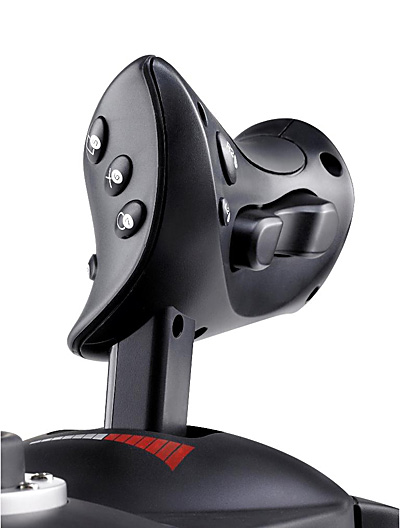

railworks-hotas
===============

Use one of these as combined power/brake controller in Train Simulator 2017:

Device pictured is 'Thrustmaster T-Flight Hotas X'.

The project is written in Python.
